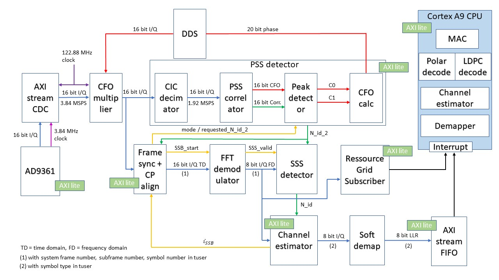
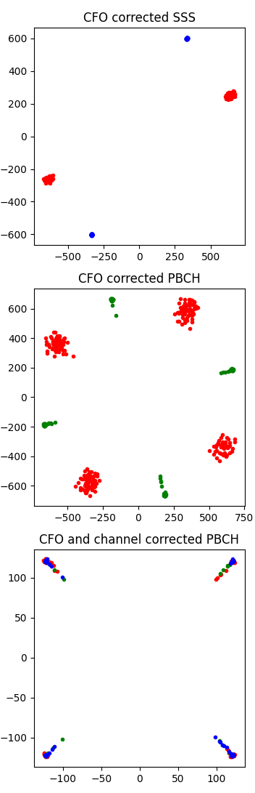
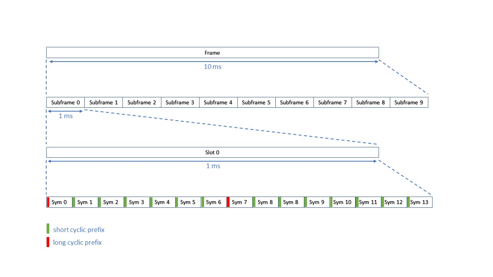
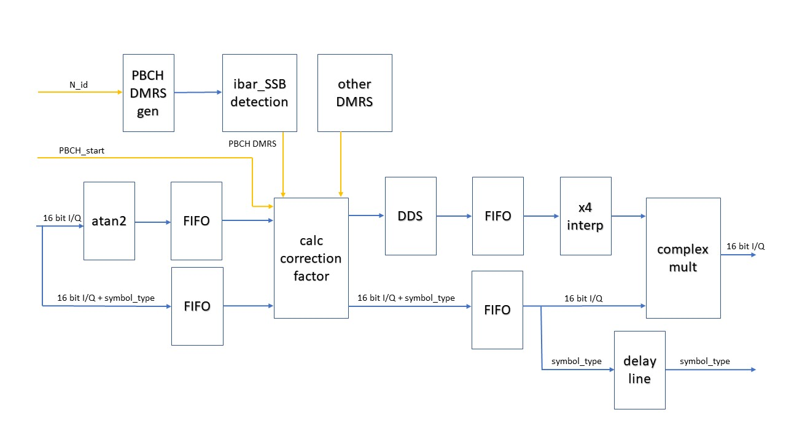

[](https://github.com/catkira/open5G_rx/actions/workflows/verify.yml)

# Overview
This is a verilog HDL core for a 5G NR lower phy receiver. It is optimized for low ressource usage so that it can run on a [PlutoSDR](https://www.analog.com/en/design-center/evaluation-hardware-and-software/evaluation-boards-kits/adalm-pluto.html), which has a Xilinx® Zynq Z-7010 with only 80 DSP slices and 28K logic cells. Since this design is optimized for low ressource usage, it can run at 3.84 MSPS (256-FFT), in that case 20 RBs (Ressource Blocks) are usable. Another option is to run this design at 7.68 MSPS (512-FFT), in that case 40 RBs are usable which is enough to accomodate the smallest possible CORESET which uses 24 RBs according to the standard. A ressource block in 5G consists of 12 subcarriers. A 256 point FFT contains 20*12=240 usable subcarriers, which leaves 8 zero carriers on each side of the spectrum. A 512 point FFT contains 40*12=480 usable subcarriers.<br>
The FFT size can easily be increased by a parameter in the code, but it will need a larger FPGA then.
<br>
Cell search is limited to 1 frequency offset range. Within this frequency offset range, the PSS correlator works up to a CFO of about += 10 kHz.
Each PSS correlator only detects one of the possible three different PSS sequences. If a general cell search for all 3 possible N_id_2's is needed, 3 PSS correlators need to be instanciated in parallel. If CFOs larger than the detection range of the PSS correlator are expected, the different CFO possibilities can be tried sequentially by configuring the receiver via its AXI-lite interface.<br>

Implemented so far:<br>
* Decimator (detailed description below)
* PSS correlator (detailed description below)
* Peak detector (detailed description below)
* PSS detector (detailed description below)
* FFT demodulator (detailed description below)
* SSS detector (detailed description below)
* Frame sync (detailed description below)
* Channel estimator (detailed description below)
* Ressource grid subscriber  (detailed description below)
* AXI-DMAC (detailed description below)

<b>Disclaimer: It is unlikely that this design which is optimized for mobility and low ressource usage will implement all possible 5G NR Phy features in hdl. It is instead intended to use this as a basis for experiments with mobile data links that are '5G like' i.e. for UAV communication. The 'Ressource Grid Subscriber' core can be used, which sends user selectable OFDM symbols via AXI-DMA to the A9 core. This can then be used to implement full 5G functionality on the CPU, or at least the reduced capability (RedCap) subset which is defined in 5G NR Release 17. A nice project would also be to interface this lower Phy to the higher Phy and MAC from the [srsRAN Project](https://github.com/srsran/srsRAN_Project).</b>



<b>TODO:</b>
* (optional) implement amplitude correction in channel_estimator
* (optional) implement PDCCH DMRS in channel_estimator
* (optional) implement QAM demod for PDSCH
* (optional) refactor PBCH DMRS generation and PBCH DMRS detection into separate cores
* (optional) optimize PSS correlator further like described [here](https://ieeexplore.ieee.org/document/8641097) or [here](https://ieeexplore.ieee.org/document/9312170)

# Ressource usage
* Decimator                 :  0 DSP slices
* PSS correlator            :  6 DSP slices (with MULT_REUSE=64)
* Peak detector             :  0 DSP slices
* FFT demodulator           :  ? DSP slices
* SSS detector              :  ? DSP slices
* Channel estimator         :  ? DSP slices
* Ressource Grid Subscriber :  0 DSP slices
* AXI-DMAC                  :  0 DSP slices

# Tests
Testbenches are written in Python using cocotb. For simulation both iverilog and Verilator are used. Iverilog is used for short tests whereas Verilator is used for tests with larger data throughput.
<br>
To install the necessary requirements for running the tests do (assuming You start in the dir where this repo is cloned):
```
  cd ..
  sudo apt install iverilog
  pip install -e requirements.txt
  git clone https://github.com/catkira/cocotb.git
  cd cocotb && pip install -e . && cd ..
  git clone https://github.com/verilator/verilator.git
  cd verilator
  git reset v5.006
  ./configure
  make -j$(nproc) && sudo make install
  cd ..
  cd open5G_rx
```
Then to run all tests do:
```
  pytest --workers $(nproc)
```
If You only want to run a simulation of the receiver do:
```
  pytest --workers $(nproc) tests/test_receiver.py
```
The following diagram shows the plots that test_receiver.py generates with 2300 Hz simulated CFO. The first plot shows the uncorrected IQ constellation plot for a PBCH packet which consists of 3 OFDM symbols. The second diagram shows the CFO corrected IQ constellation plot, red dots are from the first SSB, green dots are from the second SSB. The second SSB is received 20 ms after the first SSB and might contain a better CFO correction, because CFO correction improves itself iteratively up to a certain point. The third diagram shows the CFO and channel corrected IQ constellation of a PBCH packet. The red dots are from the first symbol, green dots from the second symbol and blue dots from the third symbol.


# Decimator
The incoming sample rate to the SSB_sync module should be 3.84 MSPS. This sample rate is then internally decimated to 1.92 MSPS so that the PSS and SSS detection cores can run most efficiently.
The PBCH demodulation core needs 3.84 MSPS. Decimation is done by [this](https://github.com/catkira/CIC) CIC core which does not need any multiplications.

# PSS correlator
Without optimizations the PSS correlator would require 128 * 3 real multipliers, 3 real multipliers for each complex multiplication. The absolute value is calculated by an approximation and does not use any multipliers. This can be further optimized by taking into account that the PSS sequence in time domain is real valued. Therefore the PSS sequence in frequency domain is complex conjugate centrally symmetric. This can be used to reduce the required number of real multipliers to 128 * 2 + 2 as shown in [this](https://ieeexplore.ieee.org/stamp/stamp.jsp?tp=&arnumber=8641097) paper. <br>
Further optimization can be achieved when taking into account that the sample rate for the SSB is only 3.84 MSPS (with 15 KHz SCS) and the PSS and SSB detection cores only need a sample rate of 1.92 MSPS. If the PSS correlator runs on a 122.88 Mhz clock, a single multiplier can be used to perform 64 multiplications at 1.92 MSPS. This feature is already implemented into the PSS correlator (PSS_correlator_mr.v) and can be adjusted by changing the MULT_REUSE parameter. <br>
For a sample rate of 1.92 MSPS and a clock rate of 122.88 MHz, the PSS correlator requires 2 * 2 real multipliers. <br><br>
The PSS correlator core supports variable widths for the data input (IN_DW), for the PSS coefficients (TAP_DW) and for the output (OUT_DW). The bit growth from input to output can be described as IN_DW / 2 + TAP_DW / 2 + 1 + ceil(log2(PSS_LEN)). If OUT_DW is not large enough to receive the whole bit growth, the output will be truncated so that only some LSBs get lost. However, in that case there will be unnecessary many ressources used, therefore it is recommended to configure the core in such a way that no truncation is needed. Since IN_DW and TAP_DW are widths for complex numbers, they have to be even numbers so that the real and imaginary part can have equal widths. <br>
A reasonable configuration would be: <br>
   IN_DW = 32 (signed I and Q) <br>
   TAP_DW = 32 (signed I and Q) <br>
   OUT_DW = 48 (unsigned) <br>
Calculation the growth gives: 16 + 16 + 1 + 7 = 40 <br>
This would allow DSP48E1 slices to be used, even for the last multipliers that are used to calculate the absolute value.
<br>
<b>TODO:</b> pipelining

# Peak detector
The peak detector takes the sum of the last WINDOW_LEN samples and compares it to the current sample. If the current sample is larger than the window sum times a DETECTION_FACTOR, then a peak is detected. DETECTION_FACTOR is currently hard coded to 16, so that the multiplication can be implemented as a shift operation. As result, this core only needs WINDOW_LEN additions and no multiplications. <br><br>
<b>TODO:</b> There is currently no pipelining implemented. For larger windows it is probably needed to break up the add operation into different stages.

# PSS detector
This core contains the decimator, PSS correlator, peak detector and CFO calculator. It also controls when the PSS correlator is active. The PSS correlator is deactived for 19.99 ms after the chosen SSB occured. 
<br>
There are usually multiple SSBs in one burst, which each SSBs coming from a different antenna. The UE is supposed to select the SSB with the strongest signal for synchronization. This design currently does not evaluate in HDL which SSB has the strongest signal, it just takes the first SSB which gets detected by the PSS correlator and peak detector. However, analysis which SSB is the best can be performed on the CPU. The CPU can then write the index of the strongest SSB (ibar_SSB) via AXI-lite to this core.

# FFT demodulator
The FFT demodulator uses [this](https://github.com/catkira/FFT) FFT core, it is configured to use dynamic block scaling. Since the core runs at 122.88 MHz while the sample rate it only 3.84 MSPS, overclocking can be used to reduce the number of required multipliers. Normally a FFT would need 3 real multipliers per stage, with overclocking this can be reduced to 1 multiplier per stage. SSS would only need a 128 point FFT, but a 256 point FFT is used anyway, so that it can also be used for PBCH demodulation. This results in 8 real multipliers required for the FFT. The FFT demodulator is synchronized to the start signal from the Peak detector. It then continuously performs FFTs. There are special tag signals for the start of the SSS and PBCH symbols. Zero carriers are removed from the output, so that each FFT outputs 240 subcarriers. The cyclic prefix advance is configurable. The ideal cyclic prefix advance to prevent ISI (inter symbol interference) is half a cyclic prefix length.

# SSS demodulator
The SSS detector currently operates in search mode, which means that it compares the received SSS sequence to all possible 335 SSS for the given N_id_1 which comes from the PSS detection.
The code is optimized to not use any multiplication and no large additions. This is achieved by doing every operation in a separate clock cycle. This means the core needs about 335 * 127 = 42545 cycles to finish the detection, assuming the system clock is 100 MHz, that would be 425 us.
The code is also memory optimized, by only storing the two m-sequences that are needed to construct all the possible SSS. It currently builds the stored m-sequences at startup using [this](https://github.com/catkira/LFSR) LFSR core. The code could be modified to have the m-sequences statically stored.

# Frame sync
This core keeps track of the current frame, subframe, slot and symbol number and controls the PSS detector. The 10 bit system frame number (SFN) whichs is contained in the BCH message needs to be sent to this core via AXI.

This core currently only supports 15 kHz SCS (subcarrier spacing) and the frame structure shown in the diagram above.
It also controls the PSS detector by sending it to sleep for 20 ms after a SSB was detected.
This core also sends the sync signals like SSB_start to the FFT_demod core. The FFT_demod core needs this timing information to generate timing information like SSS_valid and symbol_type information in its tuser output.
<br>
Frame sync outputs IQ samples in an AXI stream interface. The tuser field contains the following information {sfn, subframe_number, symbol_number, current_CP_len}. One packet has the length 512 + 18 or 512 + 20 depending on the CP length. tlast is used to signal end of packet.
<br>
<b>Important: after detection of the first SSB, sfn strats at 0. After decoding the MIB from the PBCH on the CPU, this core needs to receive the sfn of the SSB in order to output correct frame information in tuser. </b>

# Ressource Grid Subscriber (RGS)
This core sends the ressource grid via DMA to the CPU. The core can be configured to start with a certain {Frame, Subframe, Symbol)-number. The core also monitors possible overflows, this should not happen if the DMA configuration of the CPU is correct. In case of an overflow, this core will stop forwarding symbols and set an overflow flag. Forwarding can then be reenabled by setting the start {Frame, Subframe, Symbol)-number again.
Starting with a defined symbol is necessary, because the AXI-DMA core cannot transfer any meta information with the payload. (It is however considered to insert the {Frame, Subframe, Symbol)-number, this would only increase the data rate slightly but provide an extra level of robustness.)
Each symbol has the block exponent inserted at the beginning, which can be used for AGC (automatic gain control). The block exponent occupies the same space as one IQ sample.
<br>
The data rate at the output of this core is 100 frames/s * 10 subframes/frame * 14 symbols/subframe * (240 + 1) SC/symbol * 2 byte/SC = 6.72 MB/s when using a BWP (bandwidth part) of 20 RBs.
<br>
A non-continuous mode will possibly be added in the future. In the non-continuous mode it can be configured which symbols and subcarriers should be forwarded. This feature would need to scatter-gather functionality in order two forward two different blocks that are close to each other on the time axis.

# AXI-DMAC
This is a core from Analog Devices that can be found [here](https://github.com/analogdevicesinc/hdl/tree/master/library/axi_dmac). It is used with source AXI-stream interface, because this allows the RGS core to see when an overflow would happen (the source fifo interface of the axi-dmac core does not have a ready output). The advantage of using this core is that there is already a DMA kernel driver, a kernel iio driver and also client libraries (libiio). The kernel DMA driver, axi-dmac.c, provides an interface to the linux kernel DMA engine. The kernel iio driver, provides an interface to the user-space via ioctl() calls. Libiio is a user-space wrapper around the iio interface that provides a convenient API for creating DMA buffers, and enqueuing/dequeuing DMA transfers.
<br>
The CPU part of the phy allocates blocks that have the size of a single frame, this is 10 subframes/frame * 14 symbols/subframe * (240 + 1) SCs/symbol * 2 bytes/SC = 67.2 kB/frame. It is probably enough if the CPU app stores the last 20 frames, which would only need 1.344 MB RAM.
<br>
Tricky situation: When the FPGA loses synchronizations, it signals this via an IRQ from frame_sync to the CPU. The CPU then aborts all pending DMA transfers and after that initiated another sync procedure by writing via AXI-lite to the frame_sync core. Pending transfers can be aborted with iio_buffer_set_enabled(...) when using libiio, or by writing to the "enable" device attribute when using the iio sysfs interface directly. 

# Channel estimator
The channel estimator currently only corrects the phase angles, this is enough for BPSK and QPSK demodulation. It also detects the PBCH DMRS (DeModulation Reference Sequence) by comparing the incoming pilots with the 8 possible ibar_SSB configurations. The 5G standard recommends to blind decode the received PBCH for all 8 possible ibar_SSBs. This has the advantage of knowing whether a valid PBCH was received. Detecting ibar_SSB by comparing PBCH DMRS's only can lead to wrong detected ibar_SSB.
<br>
TODO: The detected ibar_SSB can be verified by setting a threshold on the correlation of the PBCH DMRS comparison. If the result is below the threshold the PSS detector should go back into search mode and search for another SSB.
<br>
The detected ibar_SSB is then send to the frame_sync core which uses this signal to align itself to the right subframe number.

